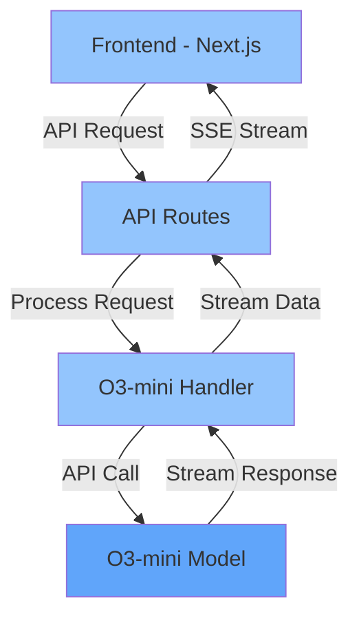
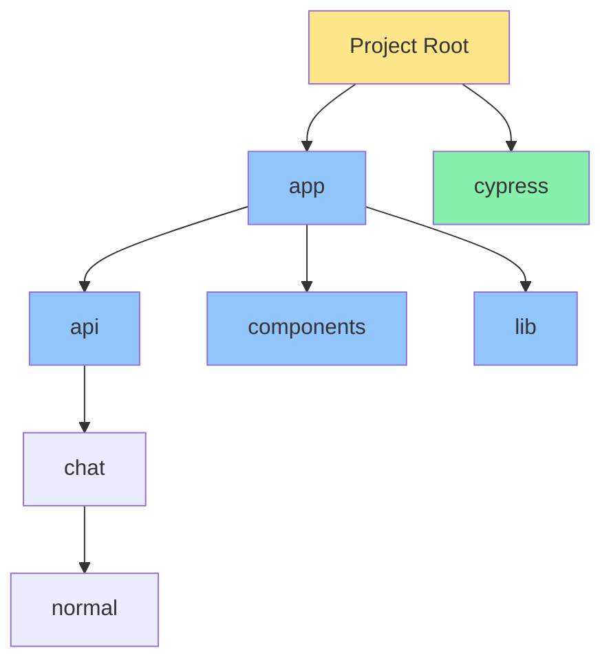
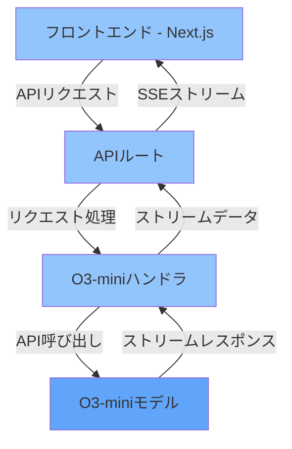
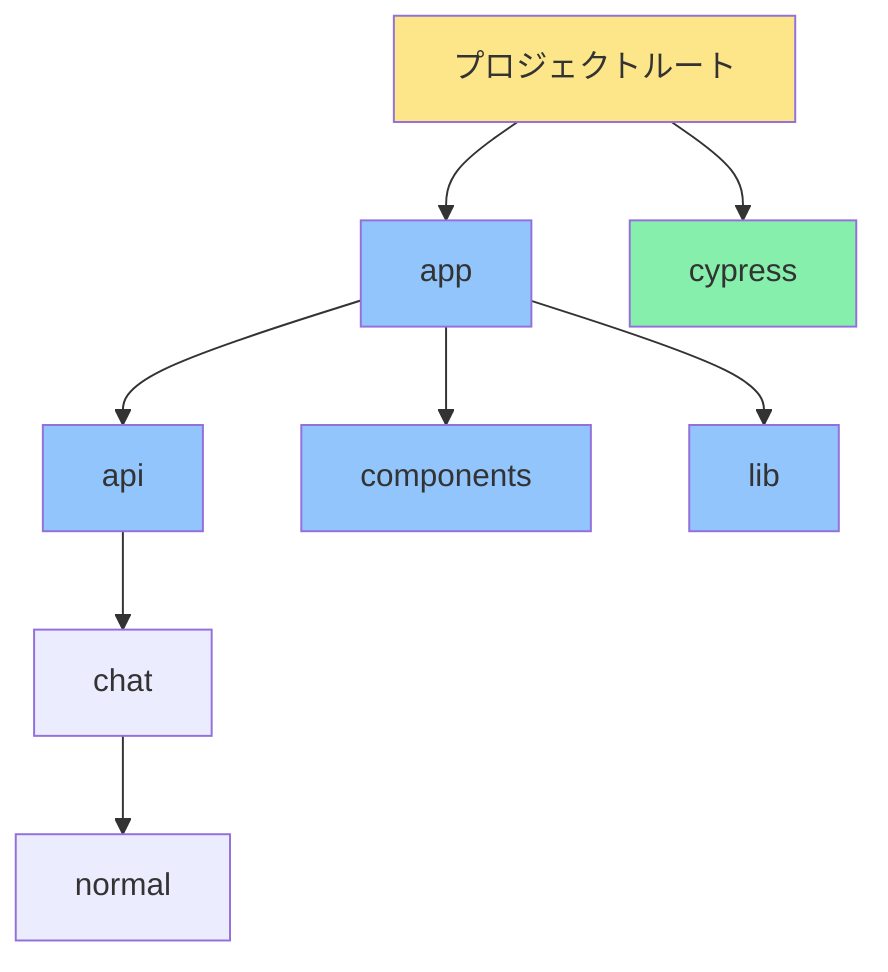

# Next.js O3-mini Chat Bot

A sophisticated chat bot application leveraging Next.js and O3-mini, optimized for high performance and reliability.

## Features

- 🤖 Integrated with O3-mini language model
- ⚡ Real-time streaming responses
- 📝 Full Markdown support
- 🎨 Modern UI with Tailwind CSS
- ✨ Debug mode for development
- 🔒 Secure API handling

## Architecture



## Tech Stack

- **Frontend**: Next.js 14, TypeScript, Tailwind CSS
- **Backend**: Next.js API Routes
- **Model**: O3-mini
- **Testing**: Cypress

## Project Structure



## Getting Started

1. Clone the repository:
```bash
git clone https://github.com/jydie5/Next.js-OpenAI-Chat-Bot.git
cd Next.js-OpenAI-Chat-Bot
```

2. Install dependencies:
```bash
npm install
```

3. Configure environment variables:
   - Copy `.env.local.example` to `.env.local`
   - Set your O3-mini API configuration

4. Start the development server:
```bash
npm run dev
```

5. Open http://localhost:3000 in your browser

---

# Next.js O3-mini チャットボット

Next.jsとO3-miniを活用した高性能で信頼性の高いチャットボットアプリケーション

## 特徴

- 🤖 O3-mini言語モデルとの統合
- ⚡ リアルタイムストリーミングレスポンス
- 📝 Markdown完全サポート
- 🎨 Tailwind CSSによるモダンUI
- ✨ 開発用デバッグモード
- 🔒 セキュアなAPI処理

## アーキテクチャ



## 技術スタック

- **フロントエンド**: Next.js 14, TypeScript, Tailwind CSS
- **バックエンド**: Next.js APIルート
- **モデル**: O3-mini
- **テスト**: Cypress

## プロジェクト構造



## 始め方

1. リポジトリのクローン:
```bash
git clone https://github.com/jydie5/Next.js-OpenAI-Chat-Bot.git
cd Next.js-OpenAI-Chat-Bot
```

2. 依存関係のインストール:
```bash
npm install
```

3. 環境変数の設定:
   - `.env.local.example`を`.env.local`にコピー
   - O3-mini APIの設定を行う

4. 開発サーバーの起動:
```bash
npm run dev
```

5. ブラウザで http://localhost:3000 を開く