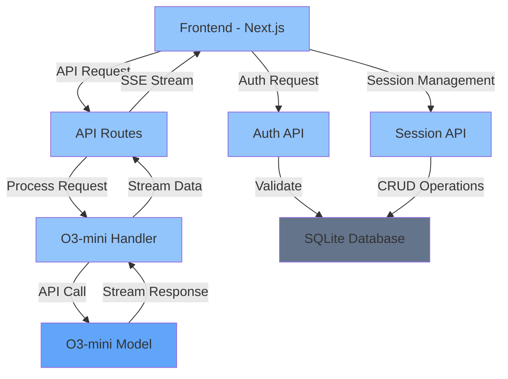
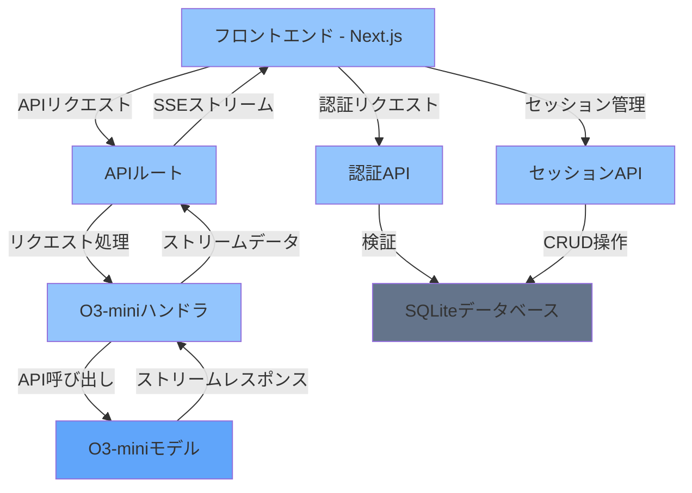
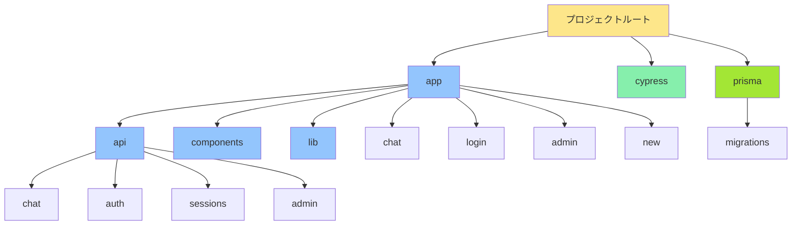

# Next.js O3-mini Chat Bot

A sophisticated chat bot application leveraging Next.js and O3-mini, optimized for high performance and reliability.

## Features

- 🤖 Integrated with O3-mini language model
- ⚡ Real-time streaming responses
- 📝 Full Markdown support
- 🎨 Modern UI with Tailwind CSS
- ✨ Debug mode for development
- 🔒 Secure API handling
- 🔐 User authentication system
- 📁 Session container management
- 👤 User management for administrators

## Architecture



## Tech Stack

- **Frontend**: Next.js 14, TypeScript, Tailwind CSS
- **Backend**: Next.js API Routes
- **Model**: O3-mini
- **Database**: SQLite with Prisma ORM
- **Authentication**: NextAuth.js
- **Testing**: Cypress

## Project Structure


 
## Getting Started

1. Clone the repository:
```bash
git clone https://github.com/jydie5/Next.js-OpenAI-Chat-Bot.git
cd Next.js-OpenAI-Chat-Bot
```

2. Install dependencies:
```bash
npm install
```

3. Set up the database:
```bash
# Generate Prisma client
npx prisma generate

# Create and initialize the database (if not exists)
npx prisma migrate dev --name init

# Seed the database with initial data
npx prisma db seed
```

4. Configure environment variables:
   - Copy `.env.local.example` to `.env.local`
   - Set your O3-mini API configuration
   - Set up NextAuth.js secret: `NEXTAUTH_SECRET=your_secret_here`
   - Set database URL: `DATABASE_URL="file:./prisma/dev.db"`

5. Start the development server:
```bash
npm run dev
```

6. Open http://localhost:3000 in your browser

7. Default admin credentials:
   - Username: admin
   - Password: 12345678

## Authentication System

This application implements a complete user authentication system using NextAuth.js and SQLite:

- User registration and login
- Session management
- Role-based access control (admin and regular users)
- Secure password handling

## Session Container Management

The chat system includes a sophisticated session container management:

- Automatic session creation and update
- Real-time session list updates
- Session history stored in the database
- Message history within each session
- Dynamic session title management

## Administrator Features

Admin users have access to additional features:

- User management (create, edit, delete)
- View all sessions across users
- Grant or revoke admin privileges
- System monitoring and maintenance

---

# Next.js O3-mini チャットボット

Next.jsとO3-miniを活用した高性能で信頼性の高いチャットボットアプリケーション

## 特徴

- 🤖 O3-mini言語モデルとの統合
- ⚡ リアルタイムストリーミングレスポンス
- 📝 Markdown完全サポート
- 🎨 Tailwind CSSによるモダンUI
- ✨ 開発用デバッグモード
- 🔒 セキュアなAPI処理
- 🔐 ユーザー認証システム
- 📁 セッションコンテナ管理
- 👤 管理者向けユーザー管理機能

## アーキテクチャ



## 技術スタック

- **フロントエンド**: Next.js 14, TypeScript, Tailwind CSS
- **バックエンド**: Next.js APIルート
- **モデル**: O3-mini
- **データベース**: SQLite with Prisma ORM
- **認証**: NextAuth.js
- **テスト**: Cypress

## プロジェクト構造



## 始め方

1. リポジトリのクローン:
```bash
git clone https://github.com/jydie5/Next.js-OpenAI-Chat-Bot.git
cd Next.js-OpenAI-Chat-Bot
```

2. 依存関係のインストール:
```bash
npm install
```

3. データベースのセットアップ:
```bash
# Prismaクライアントを生成
npx prisma generate

# データベースの作成と初期化（存在しない場合）
npx prisma migrate dev --name init

# データベースの初期データ投入
npx prisma db seed
```

4. 環境変数の設定:
   - `.env.local.example`を`.env.local`にコピー
   - O3-mini APIの設定を行う
   - NextAuth.jsのシークレットを設定: `NEXTAUTH_SECRET=your_secret_here`
   - データベースURLを設定: `DATABASE_URL="file:./prisma/dev.db"`

5. 開発サーバーの起動:
```bash
npm run dev
```

6. ブラウザで http://localhost:3000 を開く

7. デフォルト管理者アカウント:
   - ユーザー名: admin
   - パスワード: 12345678

## 認証システム

このアプリケーションはNextAuth.jsとSQLiteを使用した完全なユーザー認証システムを実装しています:

- ユーザー登録とログイン
- セッション管理
- ロールベースのアクセス制御（管理者と一般ユーザー）
- セキュアなパスワード処理

## セッションコンテナ管理

チャットシステムには高度なセッションコンテナ管理機能が含まれています:

- 自動セッション作成と更新
- リアルタイムセッションリスト更新
- データベースに保存されるセッション履歴
- 各セッション内のメッセージ履歴
- 動的セッションタイトル管理

## 管理者機能

管理者ユーザーは追加機能にアクセスできます:

- ユーザー管理（作成、編集、削除）
- すべてのユーザーのセッション表示
- 管理者権限の付与と取り消し
- システム監視とメンテナンス