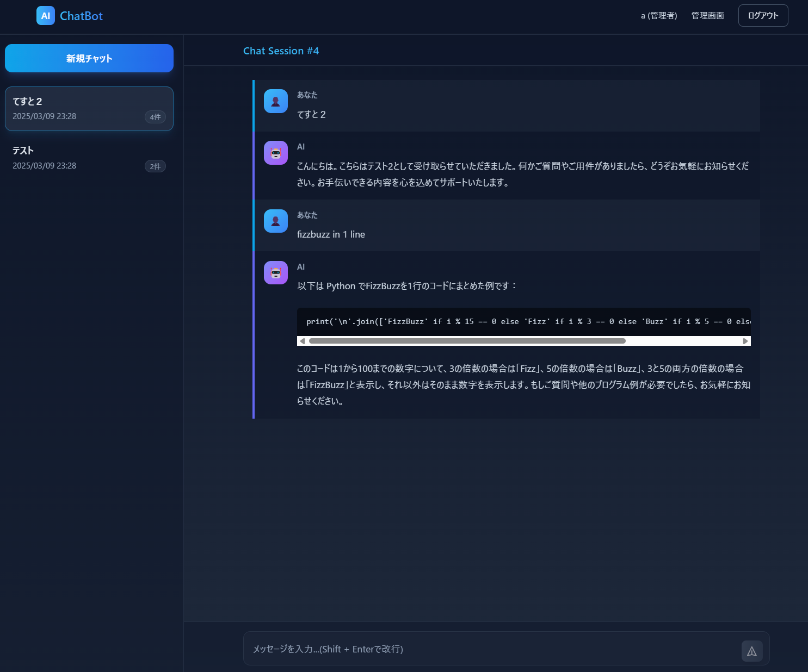

# Next.js Multi-Model Chat Bot (featuring Gemini 2.5)

A sophisticated chat bot application leveraging Next.js with multiple AI models (O3-mini, GPT-4, Gemini 2.5), optimized for high performance and reliability.



## Features

- 🤖 Integrated with O3-mini, GPT-4, and Gemini language models
- ⚡ Real-time streaming responses
- 📝 Full Markdown support
- 🎨 Modern UI with Tailwind CSS
- ✨ Debug mode for development
- 🔒 Secure API handling
- 🔐 User authentication system
- 📁 Session container management
- 👤 User management for administrators

## Architecture


## Tech Stack

- **Frontend**: Next.js 14, TypeScript, Tailwind CSS
- **Backend**: Next.js API Routes
- **Model**: O3-mini, GPT-4o, Gemini 2.5 Pro Experimental
- **Database**: SQLite with Prisma ORM
- **Authentication**: NextAuth.js
- **Testing**: Cypress

## Project Structure


 
## Getting Started

1. Clone the repository:
```bash
git clone https://github.com/jydie5/Next.js-OpenAI-Chat-Bot.git
cd Next.js-OpenAI-Chat-Bot
```

2. Install dependencies:
```bash
npm install
```

3. Configure environment variables:
   Create a new `.env` file in the project root with the following content:

```bash
# Database configuration
DATABASE_URL="file:./prisma/dev.db"

# Authentication configuration (required for NextAuth.js)
NEXTAUTH_SECRET="temporary_secure_secret_key_please_change_in_production"
NEXTAUTH_URL="http://localhost:3000"

# API configuration
OPENAI_API_KEY=your_openai_api_key_here
GOOGLE_API_KEY=your_google_api_key_here  # Required for Gemini model
```

Note: In production, make sure to replace the NEXTAUTH_SECRET with a secure random value:
```bash
# Generate a secure secret for production
openssl rand -base64 32
```

4. Set up the database:
```bash
# Reset database, apply migrations, and seed initial data
npx prisma migrate reset --force
```

5. Start the development server:
```bash
npm run dev
```

6. Open http://localhost:3000 in your browser

7. Default admin credentials:
   - Username: admin
   - Password: 12345678

## Environment Variables

The application requires the following environment variables to be set:

| Variable | Description | Example |
|----------|-------------|---------|
| `DATABASE_URL` | SQLite database file path | `"file:./dev.db"` |
| `NEXTAUTH_URL` | Base URL for NextAuth.js | `"http://localhost:3000"` |
| `NEXTAUTH_SECRET` | Secret key for session encryption | Generated secure string |
| `OPENAI_API_KEY` | OpenAI API key for the chat model | Your API key |

## Authentication Setup

This application uses NextAuth.js for authentication. Follow these steps to set it up properly:

1. **Generate a secure secret key** - This is essential for secure session management:
   ```bash
   openssl rand -base64 32
   ```
   
2. **Update your `.env` file** - Add the generated key:
   ```
   NEXTAUTH_SECRET="your-generated-secret"
   NEXTAUTH_URL="http://localhost:3000"
   ```

3. **Initial Admin Account** - The database is seeded with an initial admin account:
   - Username: `admin`
   - Password: `12345678`
   - After first login, it's recommended to change the default password

4. **Custom Authentication Flow** - The application implements credential-based authentication with password hashing using bcrypt.

5. **Session Management** - Sessions are stored in the database and managed by NextAuth.js, providing secure authentication state persistence.

## Authentication System

This application implements a complete user authentication system using NextAuth.js and SQLite:

- User registration and login
- Session management
- Role-based access control (admin and regular users)
- Secure password handling

## Session Container Management

The chat system includes a sophisticated session container management:

- Automatic session creation and update
- Real-time session list updates
- Session history stored in the database
- Message history within each session
- Dynamic session title management

## Administrator Features

Admin users have access to additional features:

- User management (create, edit, delete)
- View all sessions across users
- Grant or revoke admin privileges
- System monitoring and maintenance

---

# Next.js マルチモデル チャットボット（Gemini 2.5対応）

Next.jsと複数のAIモデル（O3-mini、GPT-4、Gemini 2.5）を活用した高性能で信頼性の高いチャットボットアプリケーション

## 特徴

- 🤖 O3-mini、GPT-4、Gemini言語モデルとの統合
- ⚡ リアルタイムストリーミングレスポンス
- 📝 Markdown完全サポート
- 🎨 Tailwind CSSによるモダンUI
- ✨ 開発用デバッグモード
- 🔒 セキュアなAPI処理
- 🔐 ユーザー認証システム
- 📁 セッションコンテナ管理
- 👤 管理者向けユーザー管理機能

## アーキテクチャ


## 技術スタック

- **フロントエンド**: Next.js 14, TypeScript, Tailwind CSS
- **バックエンド**: Next.js APIルート
- **モデル**: O3-mini, GPT-4o, Gemini 2.5 Pro Experimental
- **データベース**: SQLite with Prisma ORM
- **認証**: NextAuth.js
- **テスト**: Cypress

## プロジェクト構造


## 始め方

1. リポジトリのクローン:
```bash
git clone https://github.com/jydie5/Next.js-OpenAI-Chat-Bot.git
cd Next.js-OpenAI-Chat-Bot
```

2. 依存関係のインストール:
```bash
npm install
```

3. 環境変数の設定:
   プロジェクトのルートディレクトリに新しい`.env`ファイルを作成し、以下の内容を設定します:

```bash
# データベース設定
DATABASE_URL="file:./prisma/dev.db"

# 認証設定（NextAuth.js必須）
NEXTAUTH_SECRET="temporary_secure_secret_key_please_change_in_production"
NEXTAUTH_URL="http://localhost:3000"

# API設定
OPENAI_API_KEY=your_openai_api_key_here
GOOGLE_API_KEY=your_google_api_key_here  # Geminiモデルに必要
```

注意: 本番環境では、NEXTAUTH_SECRETを安全な乱数値に置き換えてください:
```bash
# 本番環境用の安全なシークレットを生成
openssl rand -base64 32
```

4. データベースのセットアップ:
```bash
# データベースのリセット、マイグレーション適用、初期データ投入を実行
npx prisma migrate reset --force
```

5. 開発サーバーの起動:
```bash
npm run dev
```

6. ブラウザで http://localhost:3000 を開く

7. デフォルト管理者アカウント:
   - ユーザー名: admin
   - パスワード: 12345678

## 環境変数

アプリケーションには以下の環境変数が必要です:

| 変数名 | 説明 | 例 |
|----------|-------------|---------|
| `DATABASE_URL` | SQLiteデータベースのファイルパス | `"file:./dev.db"` |
| `NEXTAUTH_URL` | NextAuth.jsのベースURL | `"http://localhost:3000"` |
| `NEXTAUTH_SECRET` | セッション暗号化用のシークレットキー | 生成されたセキュアな文字列 |
| `OPENAI_API_KEY` | チャットモデル用のOpenAI APIキー | あなたのAPIキー |

## 認証セットアップ

このアプリケーションはNextAuth.jsを使用して認証を行います。適切に設定するには以下の手順に従ってください:

1. **セキュアなシークレットキーを生成** - これはセキュアなセッション管理に不可欠です:
   ```bash
   openssl rand -base64 32
   ```
   
2. **`.env`ファイルを更新** - 生成したキーを追加:
   ```
   NEXTAUTH_SECRET="生成したシークレット"
   NEXTAUTH_URL="http://localhost:3000"
   ```

3. **初期管理者アカウント** - データベースには初期管理者アカウントがシードされています:
   - ユーザー名: `admin`
   - パスワード: `12345678`
   - 初回ログイン後、デフォルトのパスワードを変更することをお勧めします

4. **カスタム認証フロー** - アプリケーションはbcryptを使用したパスワードハッシュ化を伴う認証情報ベースの認証を実装しています。

5. **セッション管理** - セッションはデータベースに保存され、NextAuth.jsによって管理され、セキュアな認証状態の永続化を提供します。

## 認証システム

このアプリケーションはNextAuth.jsとSQLiteを使用した完全なユーザー認証システムを実装しています:

- ユーザー登録とログイン
- セッション管理
- ロールベースのアクセス制御（管理者と一般ユーザー）
- セキュアなパスワード処理

## セッションコンテナ管理

チャットシステムには高度なセッションコンテナ管理機能が含まれています:

- 自動セッション作成と更新
- リアルタイムセッションリスト更新
- データベースに保存されるセッション履歴
- 各セッション内のメッセージ履歴
- 動的セッションタイトル管理

## 管理者機能

管理者ユーザーは追加機能にアクセスできます:

- ユーザー管理（作成、編集、削除）
- すべてのユーザーのセッション表示
- 管理者権限の付与と取り消し
- システム監視とメンテナンス